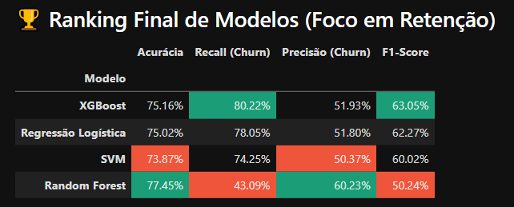
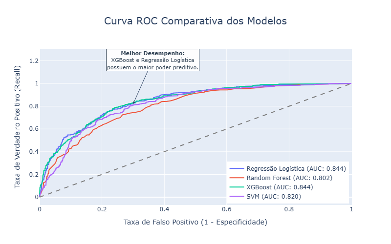
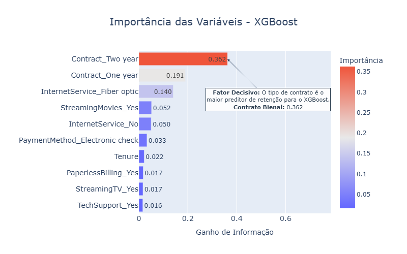
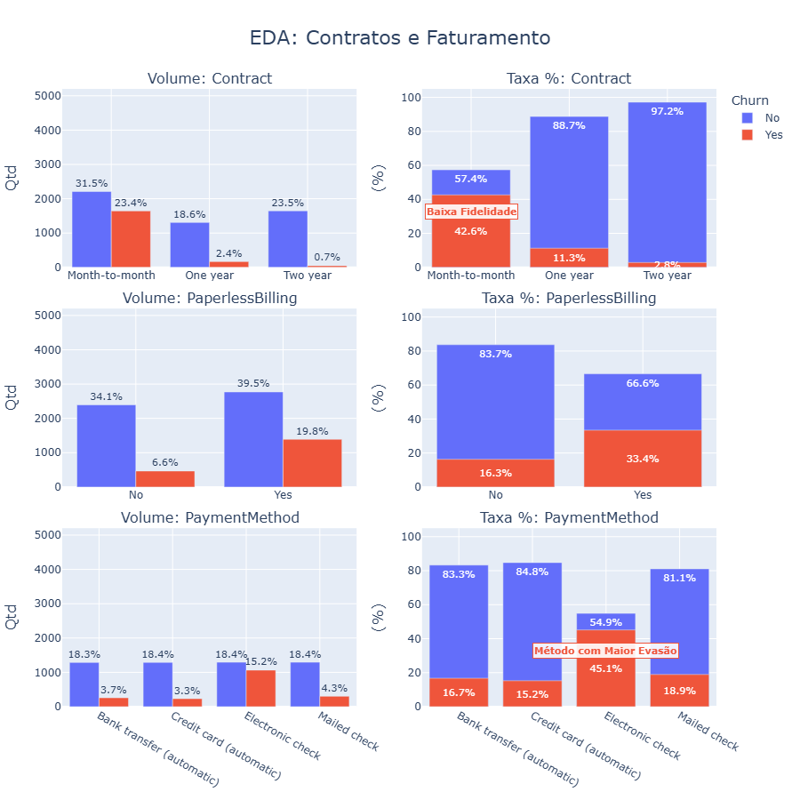
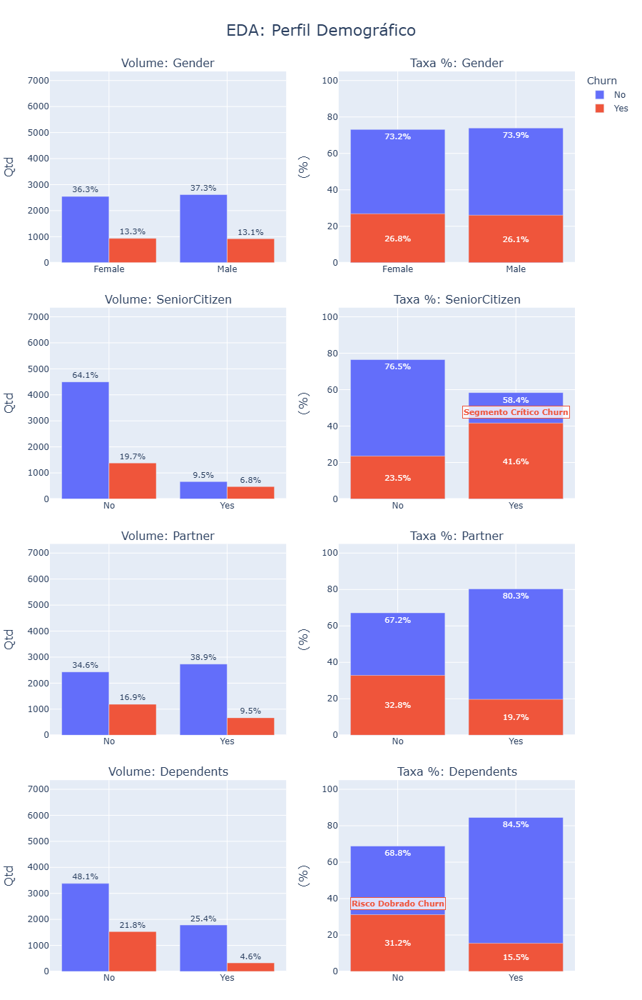
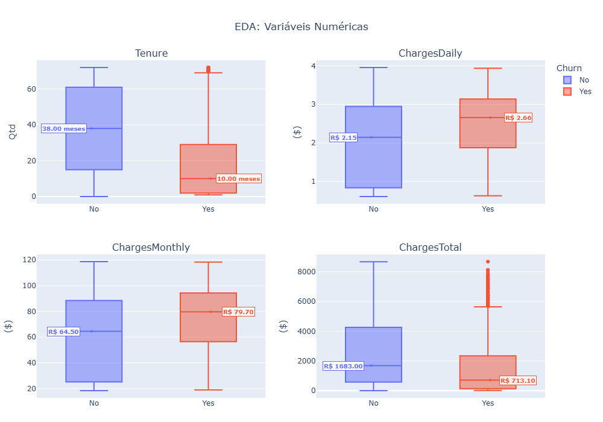

# 📡 TelecomX — Inteligência Preditiva de Churn (Parte 2)

> **Nota para execução no Colab:** Para que as funções customizadas funcionem, é necessário fazer o upload do arquivo `telecom_x_analytics.py` para a sessão do Google Colab (ícone de pasta na lateral esquerda) antes de rodar as células de importação.

## 📋 Sobre o Projeto
Este repositório consolida a segunda etapa estratégica da **TelecomX**. Enquanto a fase inicial (Parte 1) consistiu em uma análise exploratória (EDA) para entender o comportamento geral, esta **Segunda Etapa** foca na maturidade preditiva.

Para otimizar o desempenho dos modelos, realizamos um refinamento crítico do dataset, eliminando variáveis redundantes e focando no que realmente impacta a decisão do cliente. Além disso, toda a lógica de visualização e métricas foi modularizada no arquivo `telecom_x_analytics.py`, garantindo um código limpo e de fácil manutenção.

[Visualizar Relatório Interativo (HTML)](https://htmlpreview.github.io/?https://github.com/WBruni/analise-churn-telecom-x_parte_2/blob/main/Relatorio_TelecomX_Parte_2.html)

---

## 🤖 Inteligência Preditiva e Diagnóstico (Data Insights)

Nesta fase, o foco saiu da análise descritiva para a capacidade de antecipação. Abaixo, destacamos os diagnósticos extraídos:

### 1. Desempenho e Curva de Aprendizado
Priorizamos o **Recall** para garantir a identificação do maior número possível de clientes em risco.

**Ranking de Modelos (Foco em Retenção)**

**Curva ROC (Poder de Separação)**

---

### 2. O Motor da Decisão (Feature Importance)
O modelo **XGBoost** identificou o tipo de contrato e o tempo de casa (Tenure) como os principais fatores de retenção.

**Importância de Variáveis (XGBoost)**

**Análise de Atrito Contratual e Financeiro**

---

### 3. Segmentos de Risco e Ticket Médio
Identificação de onde a perda de receita é mais acentuada através do perfil demográfico e financeiro.

**Perfil Demográfico Crítico**

**Distribuição Financeira (Ticket Médio)**

---

## 🔍 Principais Insights do Projeto

* **Vulnerabilidade Contratual:** O contrato "mês a mês" é o maior facilitador da saída.
* **Barreira de Pagamento:** O boleto eletrônico apresenta atrito significativamente maior que o débito automático.
* **Ticket Alto:** Clientes de Fibra Óptica com faturas elevadas possuem maior taxa de cancelamento.

---

## 💡 Plano de Ação Estratégico

1.  **Estabilização Contratual:** Migração de clientes mensais para anuais com benefícios progressivos.
2.  **Otimização de Pagamento:** Incentivo ao uso de métodos automáticos (Débito/Cartão).
3.  **Retenção Preditiva:** Integração do modelo XGBoost ao CRM para alertas automáticos de "Alto Risco".

---

## 🛠️ Tecnologias Utilizadas

*  **Python**: Linguagem principal.
*  **Pandas**: Manipulação de dados.
*  **NumPy**: Cálculos numéricos.
*  **Plotly**: Dashboards interativos.
*  **Scikit-learn**: Aprendizado de máquina.
*  **XGBoost**: Modelo Recomendado.
*  **Jupyter Lab**: Ambiente de desenvolvimento.
---

## 📂 Estrutura do Repositório

* `data/`: Dataset refinado para treinamento e arquivos de teste.
* `images/`: Gráficos, visualizações e capturas de tela do simulador.
* `modelo_churn_xgb.pkl`: Arquivo do modelo preditivo treinado e pronto para uso.
* `pre_processador.pkl`: Objeto para tratamento e normalização de dados no simulador.
* `Relatorio_TelecomX_Parte_2.html`: Relatório final interativo em formato HTML.
* `requirements.txt`: Arquivo de configuração que permite instalar todas as bibliotecas necessárias automaticamente.
* `simulador_churn_telecom_x.py`: Script principal do simulador interativo.
* `telecom_x_analytics.py`: Motor de funções modulares utilizado pelo Notebook e pelo App.
* `TelecomX_BR_Parte_2.ipynb`: Código completo, modelagem e análises preditivas.

---

## 💻 Simulador Interativo
O projeto inclui o arquivo `simulador_churn_telecom_x.py`, que permite realizar previsões de Churn em tempo real através de uma interface visual desenvolvida com **Streamlit**. O simulador utiliza o modelo XGBoost treinado para diagnosticar o risco de cancelamento de novos clientes de forma imediata.

O simulador está disponível online para testes:
👉 [Acesse o Simulador Aqui](https://simulador-churn-telecom-x.streamlit.app/)

**Como rodar o simulador:**
1. Instale as bibliotecas com o comando: `pip install -r requirements.txt`
2. Inicie o app com o comando no terminal: `streamlit run simulador_churn_telecom_x.py`

---

## 🚀 Como Executar

1. Clone o repositório: `git clone https://github.com/WBruni/analise-churn-telecom-x_parte_2.git`
2. **⚠️ Importante:** Certifique-se de que o arquivo `telecom_x_analytics.py` permaneça no mesmo diretório que o notebook, pois ele contém as funções de suporte essenciais.
3. Instale as bibliotecas necessárias: `pip install pandas numpy plotly scikit-learn xgboost`
4. Abra o arquivo `TelecomX_BR_Parte_2.ipynb` para visualizar a análise completa.

---

**Desenvolvido por:** [Wagner Bruni Batista]

**Contato:**
* 👤 **E-mail:** [wagnerbruni@terra.com.br]

* 